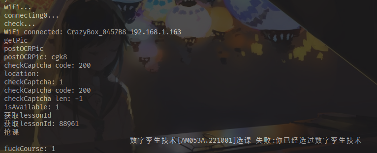
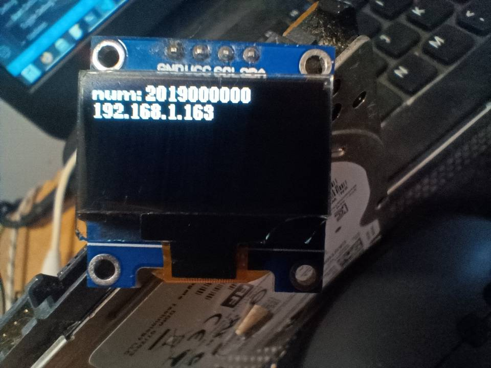

# FuckOAA

快速选择你的课程,简称"抢课"

基于 ESP8266(CH340) + SSD1306

目前请参考: https://www.jysafe.cn/4498.air

## 运行你的局域网OCR服务器

```
docker run -p 4006:4006 --name vercode jiyecafe/wecuit_py
```

Docker镜像相关源代码在这里(仅供参考,可忽略): https://github.com/WeCuit/WeCuit-API-PY

## 简单食用

1. 重命名 `data/config.example.json` 为 `data/config.json`
2. 修改配置, 参数获取暂时参考: https://www.jysafe.cn/4498.air
3. 将程序写入ESP8266
4. 上传配置到ESP8266

## 已实现

- [x] 验证码识别
- [x] 选课(有同学反应不能用,可能需要修正)

## TODO

 - [ ] 代码结构优化
 - [ ] 网页端控制
 - [ ] 使用帐号密码自动获取cookie
 - [ ] cookie刷新
 - [ ] 全自动无人值守 

## 预览

### 串口输出



### 屏幕显示


